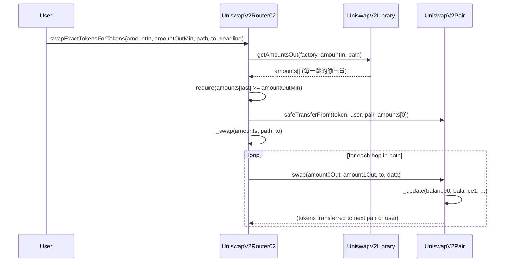
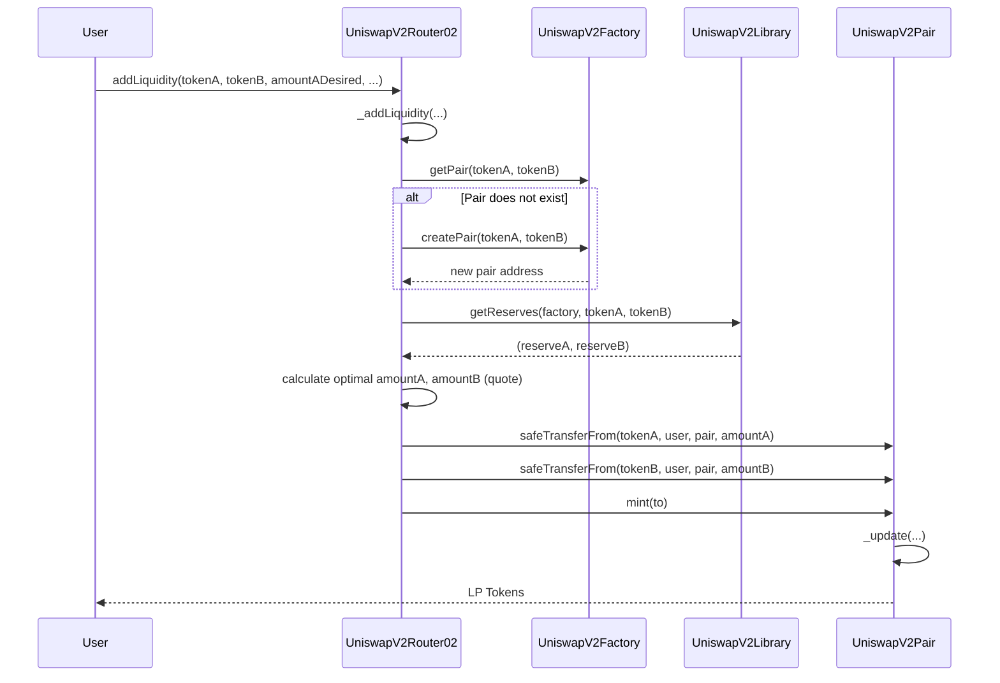
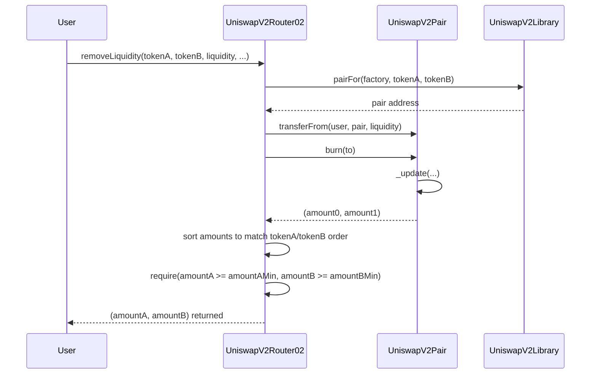

# C1: 跟代码跑流程 - Uniswap V2 调用链

> **目标**: 不精读代码，只跟踪调用链。知道"谁调用谁"。
> **产出**: 三张流程图 (Swap, AddLiquidity, RemoveLiquidity)。

---

## 1. Swap 调用链 (swapExactTokensForTokens)

用户想用精确数量的 Token A 换取尽可能多的 Token B。

### 调用链总结
1.  **Router.swapExactTokensForTokens** (入口)
2.  **Library.getAmountsOut** (预计算每一跳的输出)
3.  **TransferHelper.safeTransferFrom** (把用户的 Token 转到第一个 Pair)
4.  **Router._swap** (内部循环，遍历路径)
5.  **Pair.swap** (核心：在 Pair 合约内完成原子交换)

### 你需要追踪的代码位置
| 步骤 | 文件 | 函数 |
|------|------|------|
| 入口 | `UniswapV2Router02.sol` | `swapExactTokensForTokens` |
| 计算 | `UniswapV2Library.sol` | `getAmountsOut`, `getAmountOut` |
| 转账 | (external) | `TransferHelper.safeTransferFrom` |
| 循环 | `UniswapV2Router02.sol` | `_swap` |
| 核心 | `UniswapV2Pair.sol` | `swap` |

---

## 2. AddLiquidity 调用链 (addLiquidity)

用户往池子里注入两种 Token，获得 LP Token。

### 调用链总结
1.  **Router.addLiquidity** (入口)
2.  **Router._addLiquidity** (计算最优比例)
3.  **Factory.getPair / createPair** (获取或创建 Pair)
4.  **Library.getReserves** (获取当前储备)
5.  **Library.quote** (计算匹配数量)
6.  **TransferHelper.safeTransferFrom** x2 (把两种 Token 转到 Pair)
7.  **Pair.mint** (铸造 LP Token 给用户)

---

## 3. RemoveLiquidity 调用链 (removeLiquidity)

用户销毁 LP Token，取回两种底层资产。

### 调用链总结
1.  **Router.removeLiquidity** (入口)
2.  **Library.pairFor** (计算 Pair 地址)
3.  **Pair.transferFrom** (把用户的 LP Token 发送到 Pair 合约自己)
4.  **Pair.burn** (销毁 LP Token，按比例释放两种资产给 `to`)
5.  **Router** (检查最小数量，返回结果)

---

## C1 Checkpoint 小测验

完成 C1 后，你应该能回答：

1.  **Q: Router 为什么需要调用 `Library.getAmountsOut`？**
    A: 因为 Router 需要预先计算出整个路径每一跳的输出量，用于滑点检查和确定转账金额。Pair 合约本身不做这个计算。

2.  **Q: 为什么 `swap` 里没有 `transferFrom`？**
    A: 因为 Router 在调用 `_swap` **之前**，已经通过 `safeTransferFrom` 把用户的 Token 转到了第一个 Pair。`swap` 函数只负责"根据已有余额，计算输出并检查 K 值"。

3.  **Q: `mint` 和 `burn` 是谁调用的？**
    A: 是 **Router** 调用的，不是用户直接调用。Router 封装了转账和铸造/销毁的流程，用户只需要和 Router 交互。

---

## 下一步: C2 精读 Pair

理解了调用链后，我们知道 **Pair.swap / mint / burn** 才是真正的核心。下一步，我们将精读这三个函数的每一行代码。
