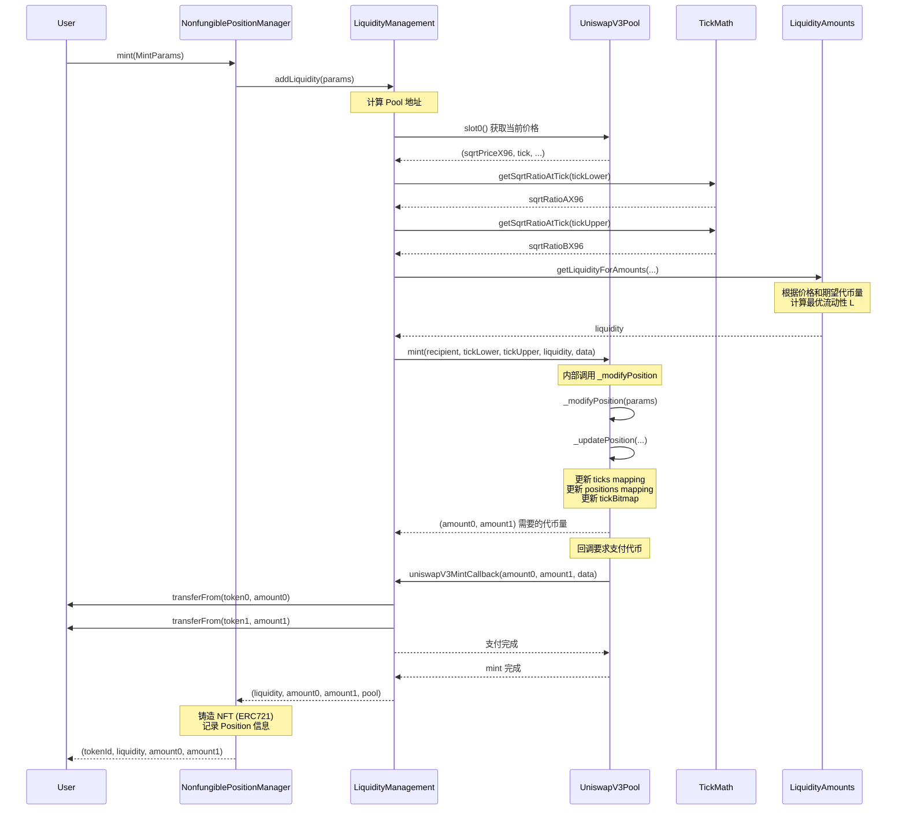
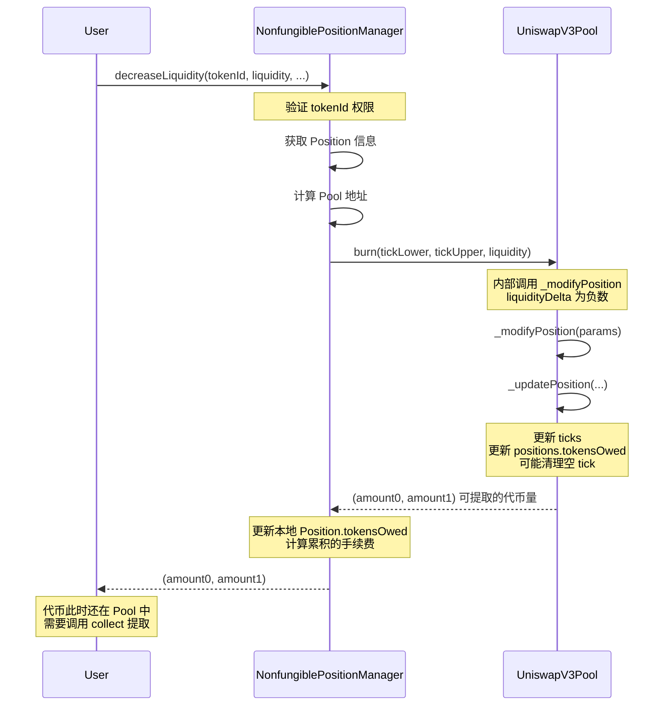
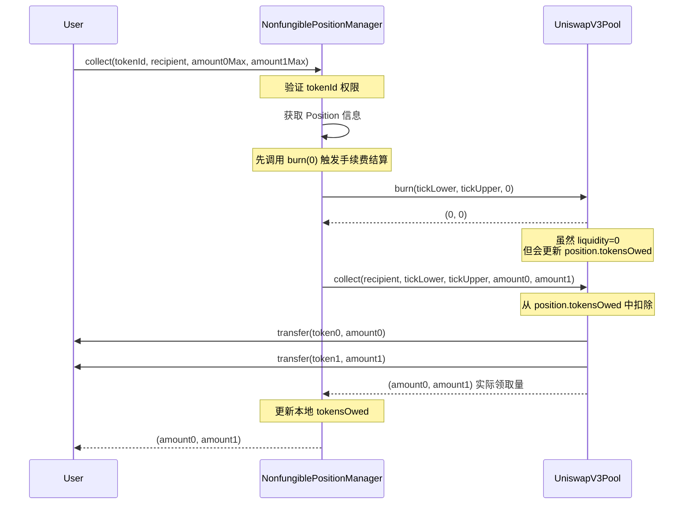
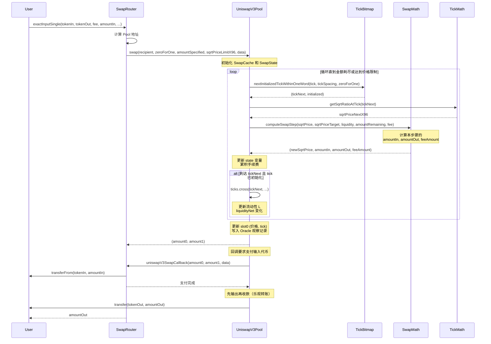
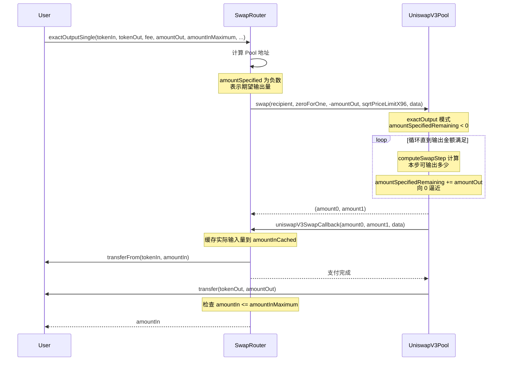
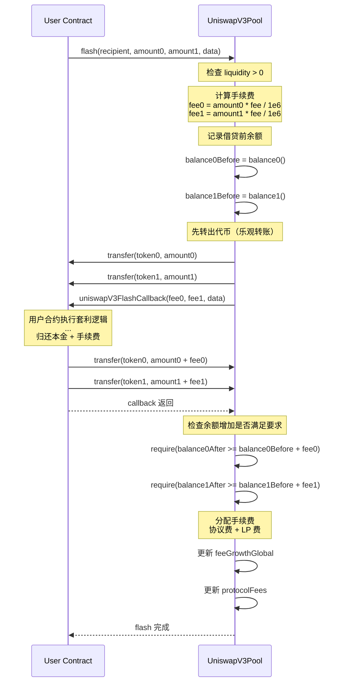
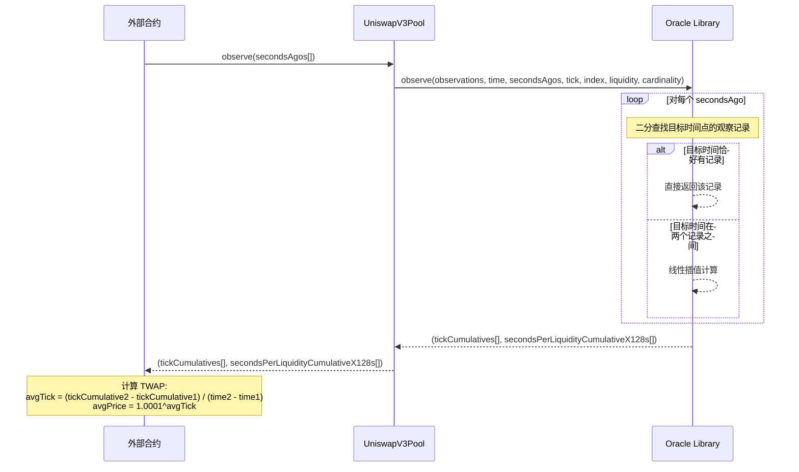
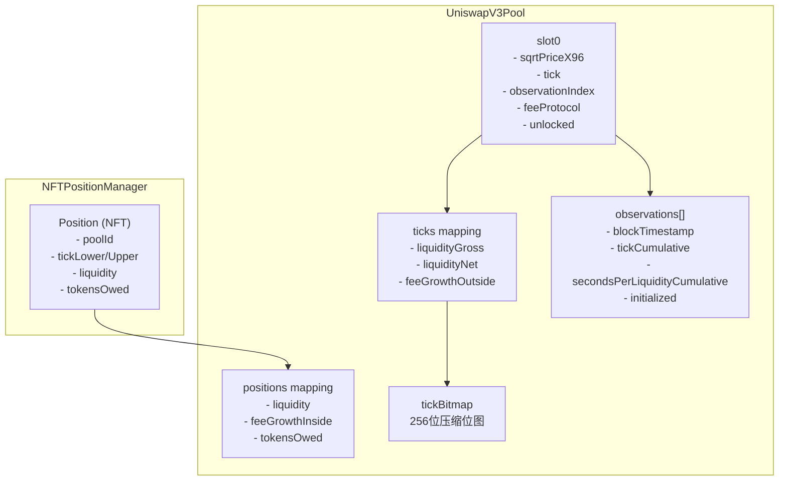

# Uniswap V3 核心调用链详解

本文档通过时序图的方式，详细展示 Uniswap V3 核心操作的函数调用链，帮助理解合约之间的交互逻辑。

---

## 1. Mint (添加流动性) 调用链

用户通过 `NonfungiblePositionManager` 铸造 NFT 头寸，添加流动性。

### 关键点

1. **NFT 作为头寸凭证**: V3 用 ERC-721 NFT 代表每个流动性头寸，替代 V2 的 LP Token
2. **流动性计算**: `LiquidityAmounts` 库根据当前价格和期望代币量，计算最优的流动性值 L
3. **回调模式**: Pool 不直接转账，而是通过回调让调用者支付代币（乐观转账）

---

## 2. Burn (移除流动性) 调用链

用户减少或移除头寸的流动性。

### 关键点

1. **两步操作**: `decreaseLiquidity` 只计算可提取量，实际提取需调用 `collect`
2. **Tick 清理**: 如果流动性减为 0 且 tick 翻转，会清除该 tick 数据以节省 Gas
3. **负向 Delta**: `liquidityDelta` 为负数时表示移除流动性

---

## 3. Collect (领取手续费) 调用链

用户领取累积的手续费和移除流动性后的代币。

### 关键点

1. **burn(0) 技巧**: 在 collect 前先调用 `burn(0)` 以结算最新的手续费
2. **tokensOwed**: 代币先记录在 `position.tokensOwed` 中，collect 时才真正转账
3. **双重记账**: NFTPositionManager 和 Pool 都有各自的 tokensOwed 记录

---

## 4. Swap (exactInput) 调用链

用户通过 SwapRouter 进行固定输入量的代币交换。

### 关键点

1. **循环交换**: Swap 是一个 while 循环，逐步穿越多个 tick 区间
2. **TickBitmap 优化**: 通过 bitmap 快速跳过无流动性的 tick 区域
3. **computeSwapStep**: 每步计算能交换的数量，可能被 tick 边界、价格限制或金额耗尽终止
4. **流动性变化**: 穿越初始化的 tick 时，全局流动性 L 会变化

---

## 5. Swap (exactOutput) 调用链

用户指定期望的输出量进行交换。

### 关键点

1. **负数表示输出**: `amountSpecified < 0` 表示固定输出模式
2. **滑点保护**: `amountInMaximum` 限制最大输入量，防止被套利
3. **amountInCached**: 用于在回调中缓存计算出的输入量

---

## 6. Flash (闪电贷) 调用链

无需抵押的即时借贷，必须在同一交易内归还本金+手续费。

### 关键点

1. **零抵押借贷**: 先给钱后检查，失败则整个交易回滚
2. **手续费计算**: 与 swap 相同的费率，向上取整
3. **协议费分成**: 手续费按比例分配给 LP 和协议方

---

## 7. Oracle (价格预言机) 调用链

外部合约查询历史 TWAP 价格。

### 关键点

1. **累积值**: 存储的是累积值，需要两个时间点相减才能得到平均值
2. **环形缓冲区**: observations 是固定大小的环形数组，旧数据会被覆盖
3. **cardinality**: 可扩展的观察槽位数量，初始为 1，可通过 `increaseObservationCardinalityNext` 扩展

---

## 核心数据结构关系图

---

## 总结

| 操作 | 入口合约 | 核心合约 | 关键函数 |
|------|----------|----------|----------|
| 添加流动性 | NonfungiblePositionManager | UniswapV3Pool | `mint` → `_modifyPosition` |
| 移除流动性 | NonfungiblePositionManager | UniswapV3Pool | `decreaseLiquidity` → `burn` |
| 领取手续费 | NonfungiblePositionManager | UniswapV3Pool | `collect` |
| 代币交换 | SwapRouter | UniswapV3Pool | `swap` → `computeSwapStep` |
| 闪电贷 | 任意合约 | UniswapV3Pool | `flash` |
| 价格查询 | 任意合约 | UniswapV3Pool | `observe` |

### V3 vs V2 核心差异

1. **集中流动性**: LP 可选择特定价格区间，资金效率大幅提升
2. **NFT 头寸**: 每个头寸是独立的 NFT，不再是同质化的 LP Token
3. **Tick 机制**: 价格空间离散化为 tick，便于高效管理流动性边界
4. **多费率池**: 同一交易对可有多个不同费率的池子 (0.05%, 0.3%, 1%)
5. **内置 Oracle**: 无需外部合约即可获取 TWAP 价格
